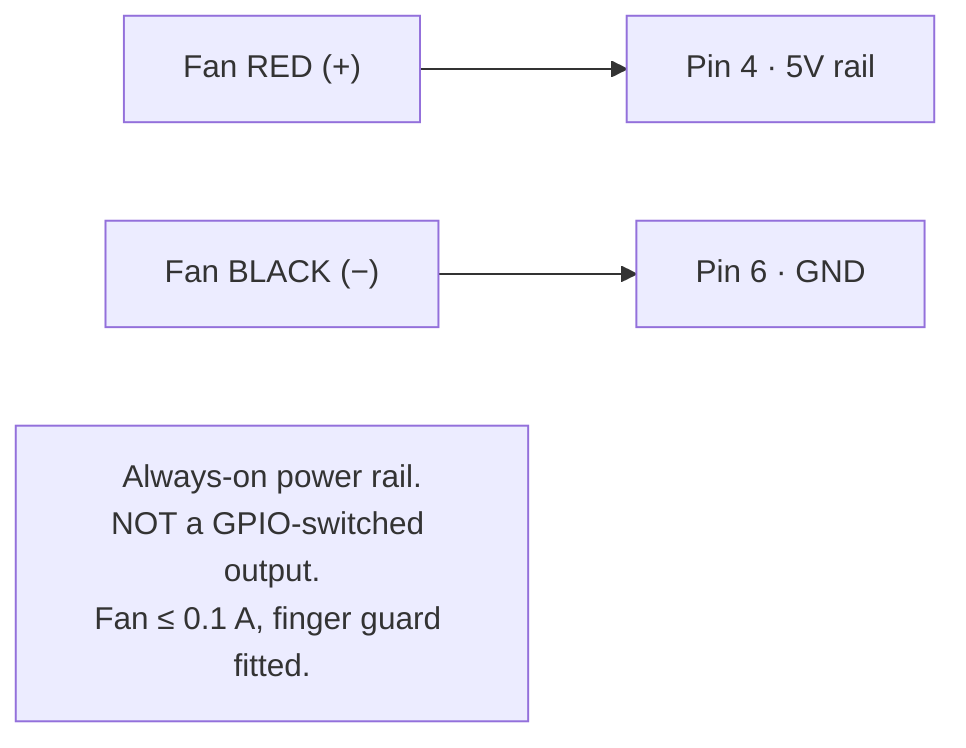
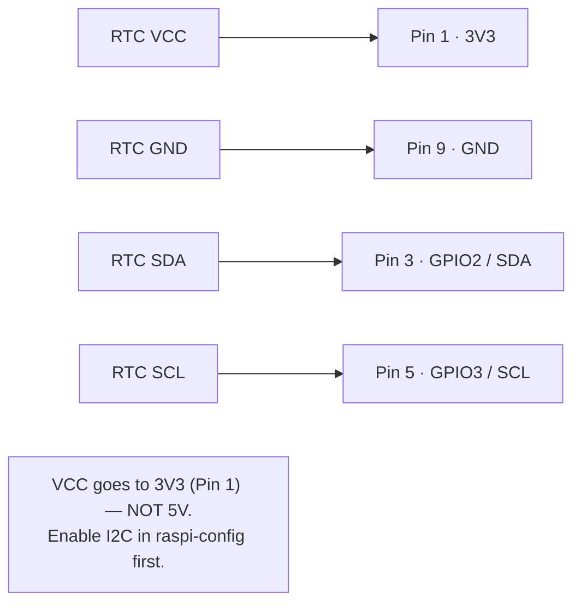
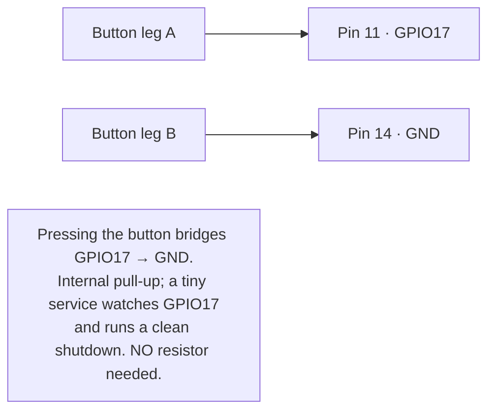
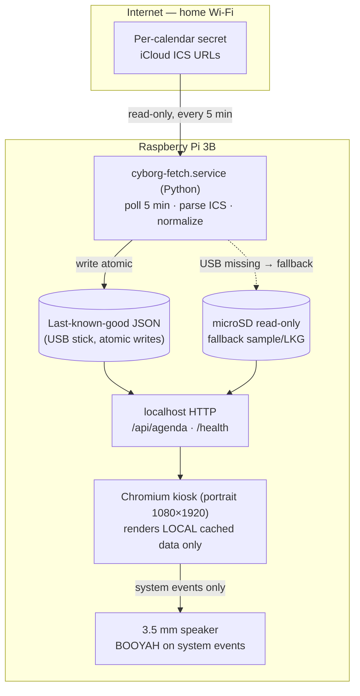
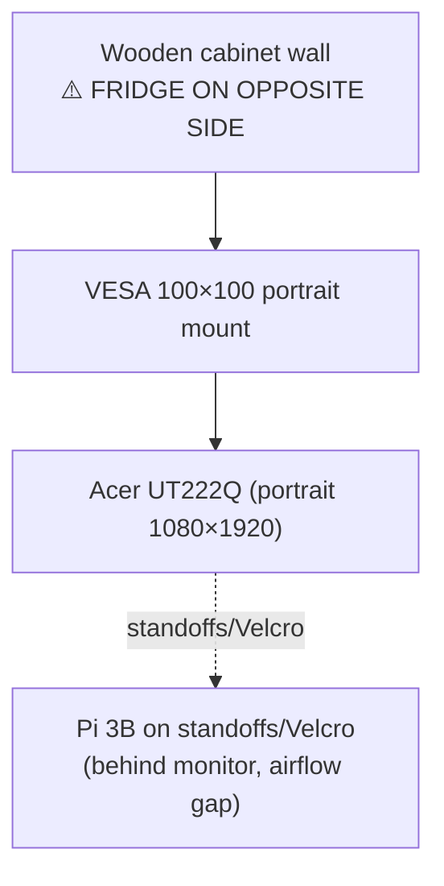

# Cyborg — Wiring & Assembly Diagrams (v1)

> These diagrams are the **source of truth** for every physical connection. They match the
> approved wiring table in `.loop-ledger/00-seed-decisions.md` §H. Diagrams are mermaid +
> ASCII so they render offline in the tutorial with no internet. **Photo-slot markers**
> (`📷 PHOTO:`) mark where a real workbench photo should be slotted in.
>
> ⚠️ **GOLDEN RULE #1 — POWER OFF FIRST:** **Unplug the Pi's power** before you touch,
> add, remove, or check ANY header/GPIO wire. Only plug power back in after an adult (or a
> second person) has checked every pin against the diagram. A loose connector brushed across
> the header while powered is the easiest way to kill the Pi.
>
> ⚠️ **GOLDEN RULE #2:** never bridge a **5 V** pin to a **3.3 V** or **GND** pin. Count pins
> twice against the header diagram before every connection. Wire **one mission at a time**,
> verify, then move on.

---

## 1. Raspberry Pi 3B 40-pin header — only the pins we use

**How to find a pin (read this slowly):** Pin 1 is the **only pin with a SQUARE solder pad**
(all the others are round) — it is at one END of the 40-pin header. The header is **two rows
of 20**. The pins are numbered in pairs going down the header: pin **1** is paired with pin
**2**, pin **3** with **4**, pin **5** with **6**, and so on. **Odd numbers (1,3,5…) are one
row; even numbers (2,4,6…) are the other row.** Do **not** rely on "which row is nearer the
edge" — that flips depending on how you hold the Pi. Always anchor on the **square pad = pin
1** and count in pairs. When in doubt, match against a printed Pi pinout and the photo.

```
   ODD ROW (1,3,5…)            EVEN ROW (2,4,6…)
   ───────────────            ────────────────
        3V3  [ 1]■  [ 2]   5V
 RTC▶ GPIO2  [ 3]   [ 4]   5V   ◀ FAN +
 RTC▶ GPIO3  [ 5]   [ 6]   GND  ◀ FAN −
       GPIO4 [ 7]   [ 8]   GPIO14
  RTC▶  GND  [ 9]   [10]   GPIO15
BTN▶ GPIO17  [11]   [12]   GPIO18
      GPIO27 [13]   [14]   GND  ◀ BUTTON −
      GPIO22 [15]   [16]   GPIO23
        3V3  [17]   [18]   GPIO24
      GPIO10 [19]   [20]   GND
        ...    (pins 21–40 unused) ...
```
`■` marks the **square pad = pin 1**. Pins 1 and 2 are side-by-side at the same end of the
header; the numbers go DOWN in pairs from there.

Legend: **FAN** = 5 V cooling fan · **RTC** = DS3231 real-time clock (I²C) · **BTN** =
safe-shutdown button. Speaker is **not** a GPIO device (3.5 mm jack).

📷 PHOTO: top-down shot of the Pi 3B header with pins 1, 4, 6, 11, 14 flagged.

---

## 2. Core cooling fan (CORE mission — "Captain of Cables")



- Fan blows **onto the SoC** (the big chip) — guard faces your fingers, blades face the board.
- Pre-crimped Dupont connectors; add a small strain-relief loop so a tug can't pull a pin.
- ✅ You'll know it worked when: on power-up you feel airflow and (later) `vcgencmd
  measure_temp` stays well under 70 °C.
- 🛟 If it didn't: fan on pins 4&6 spins immediately on boot — if it doesn't, the connector is
  backwards or on the wrong pins. Power off, recheck pin numbers.

📷 PHOTO: fan plugged onto pins 4 & 6, guard visible.

---

## 3. DS3231 RTC (CORE Level-Up — "Commander of Code")



- ⚠️ **RTC VCC goes ONLY to physical Pin 1.** Do **NOT** connect RTC VCC to Pin 2 or Pin 4 —
  those are **5 V** and will damage the 3.3 V DS3231.
- ✅ You'll know it worked when: `sudo i2cdetect -y 1` shows a device at address **0x68**.
- 🛟 If it didn't: nothing at 0x68 → SDA/SCL swapped or VCC on the wrong pin. Powering the
  DS3231 from 5 V can damage it — it must be **Pin 1 (3V3)**.
- ⚠️ Because the RTC uses **GPIO3**, the "short GPIO3 to wake a halted Pi" trick is **not**
  available. That is fine — we use the GPIO17 button instead (next).

📷 PHOTO: DS3231 module wired to pins 1/3/5/9.

---

## 4. Safe-shutdown button (BONUS — "Master of the Mount")



- ✅ You'll know it worked when: a short press cleanly powers the Pi down (green LED blinks
  the shutdown pattern, then off) — no yanking the plug.
- ℹ️ **4-leg tactile buttons:** the two legs on the same side are joined inside. Use **opposite
  (diagonal) legs**, or test continuity first, so a press actually makes the connection.
- 🛟 If it didn't: button does nothing → legs on wrong pins (or two legs on the same side), or
  the gpio-monitor service isn't enabled (see provisioning mission). Test legs with the wiring
  above before blaming software.

📷 PHOTO: button across pins 11 & 14.

---

## 5. System architecture (how the software pieces talk)



Key property: the browser **never** touches the internet — it only paints the local cached
JSON the fetch service prepared. That is what keeps a 1 GB Pi 3B smooth and the screen never
blank when Wi-Fi drops.

---

## 6. Power & mounting (portrait VESA) — "Master of the Mount"

```
   [ Switched power strip ]──┬── Official 5V/2.5A → Pi 3B (micro-USB, right-angle ok)
                             └── Monitor adapter → Acer UT222Q
   Monitor (portrait) ── HDMI (right-angle) ── Pi 3B
   Monitor ── USB-B touch cable ── Pi 3B USB   (touch mapping set in software)
   Pi 3.5mm ── powered speaker
```



⚠️ **Fridge caution (load-bearing):** before driving ANY screw, measure wall depth and screw
length so nothing penetrates toward the fridge side. Use a stud/anchor rated for the monitor
weight. Leave a **cable service loop** + strain relief, keep a **ventilation gap** for the
fan, and keep **service access** to swap the microSD/USB.

📷 PHOTO: rear of mounted monitor showing Pi, fan airflow gap, tidy cable run, and the
SD/USB access point.

---

## 7. ✅ PRE-POWER CHECKLIST (do this every time before plugging power back in)

- [ ] Pi power is **UNPLUGGED** while wiring.
- [ ] RTC VCC is on **physical Pin 1 only** (square pad). **Not** Pin 2, **not** Pin 4.
- [ ] RTC GND on Pin 9; SDA on Pin 3; SCL on Pin 5.
- [ ] Fan **red** is the only wire on **Pin 4**; fan **black** on **Pin 6**.
- [ ] Button uses **Pin 11** and **Pin 14** (diagonal legs if 4-leg).
- [ ] No bare metal / no connector is touching a neighboring pin.
- [ ] A second person has checked the board against the diagram/photo.
- [ ] 🛑 **STOP and ask an adult** if the real board doesn't match the diagram.

Only when every box is ticked: plug power back in.

---

### Diagram acceptance contract (for the reviewer)
1. Every pin matches §H wiring table exactly (4/6 fan, 1/3/5/9 RTC, 11/14 button).
2. No 5 V↔3.3 V/GND hazard; golden rule stated.
3. RTC↔GPIO3 wake exclusivity noted.
4. Architecture shows browser-paints-local-only + USB→microSD fallback.
5. Fridge/screw-depth + ventilation + service-access safety present.
6. Renders offline (mermaid + ASCII), photo-slot markers present.
